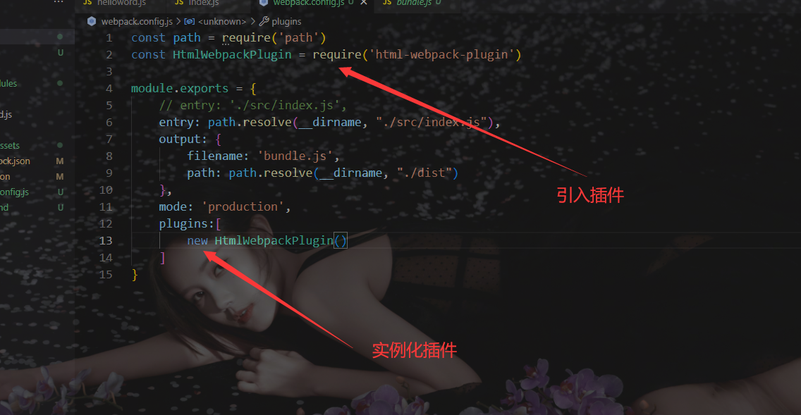
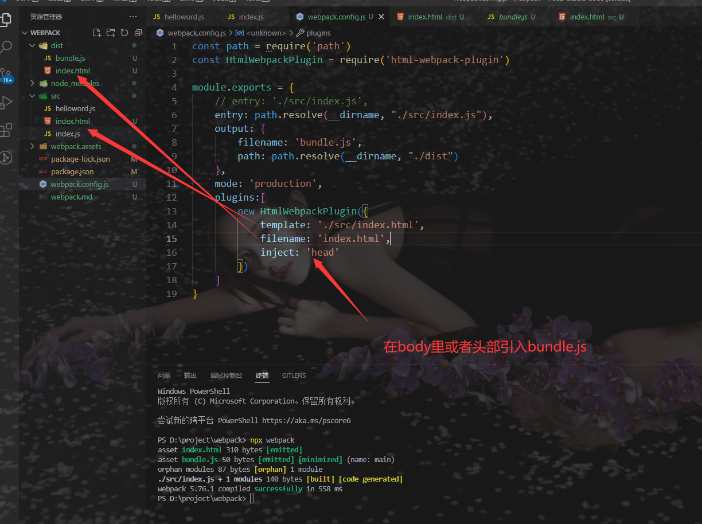
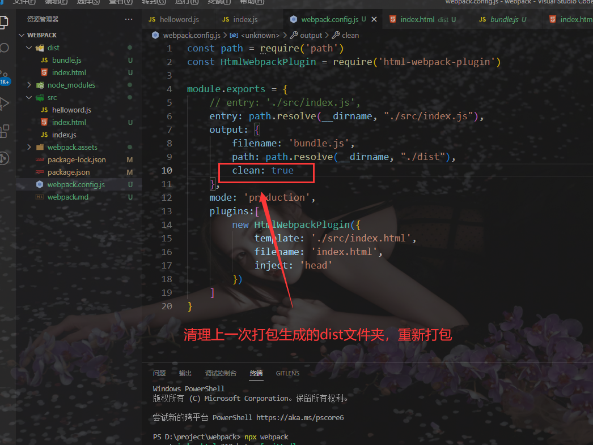
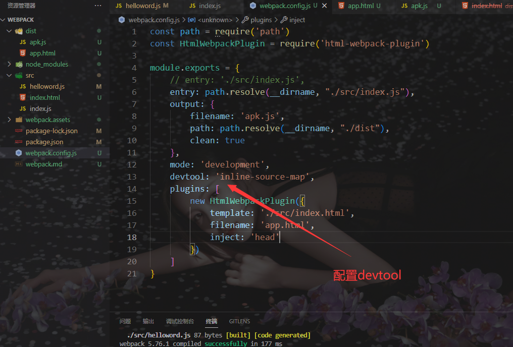
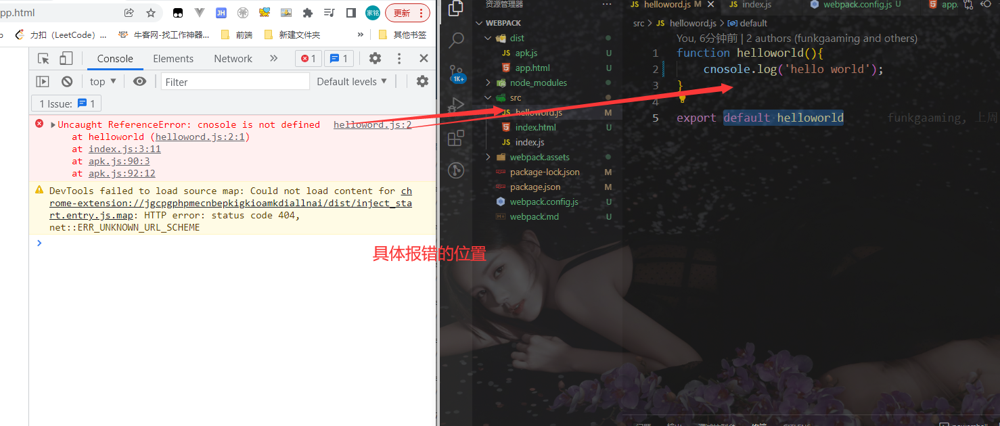
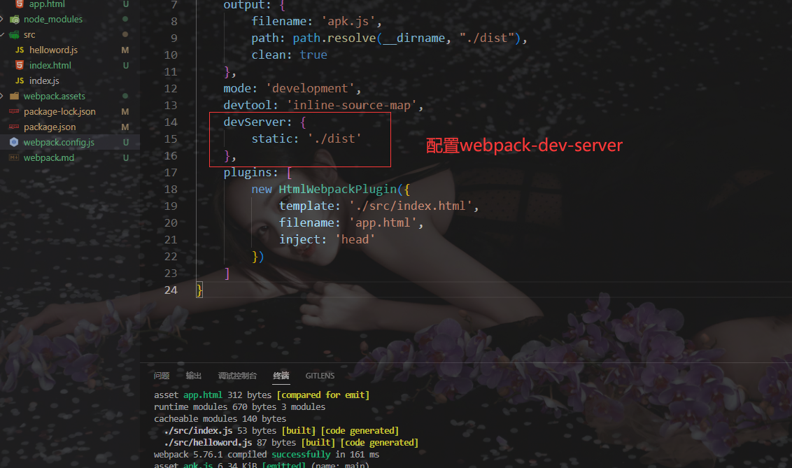
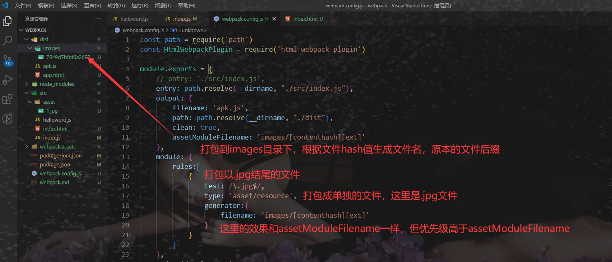

# 使用webpack

+ 本地安装webpack 和 webpack-cli 

  ```javascript
  npm install webpack webpack-cli --save-dev
  ```

+ 查看命令参数

  ```
  npx webpack --help
  ```

+ 执行打包的命令

  ```
  npx webpack（使用当前目录的）    ||    webpack（使用全局的）
  
  指定入口和模式
  npx webpack --entry ./src/index.js --mode production
  ```

+ 查看详细的打包信息

  ```
  npx webpack --stats detailed    ||    webpack --stats detailed
  ```

+ 配置文件（webpack.config.js）

  ```
  const path = require('path')
  
  module.exports = {
      // entry: './src/index.js',
      entry: path.resolve(__dirname, "./src/index.js"),
      output: {
          filename: 'bundle.js',
          path: path.resolve(__dirname, "./dist")
      },
      mode: 'production'
  }
  ```


# webpack插件

+ 安装插件

  ```
  npm install --save-dev html-webpack-plugin
  ```

+ 引入 & 实例化插件

  

+ HtmlWebpackPlugin初体验

  


# 清理上一次打包的结果

+ clean: true

  


# 搭建开发环境

### 查看报错信息在未打包文件的具体位置

+ 查看报错信息在未打包文件的具体位置

  > devtool: 'inline-source-map'

  

  


### 实时监测代码的变化自动编译,自动刷新页面内容

+ 使用npx webpack指令时，添加一个--watch

  > 这种默认打包后，页面是不刷新的吗？
  >
  > 反正我用的是Live Server

  > npx webpack --watch

+ 安装webpack-dev-server并配置, 然后启动webpack-dev-server

  > 这种既能重新打包，也能刷新页面

  > npm install --save-dev webpack-dev-server -D
  >
  > npx webpack-dev-server

  


# 加载图片文件、字体文件、图标文件等资源

### asset/resource

> 单独文件并导出URL

+ 打包图片文件

  


### asset/inline

> Data URL


### asset/source

> 资源源代码


### asset

> Data URL 和一个单独的文件之间